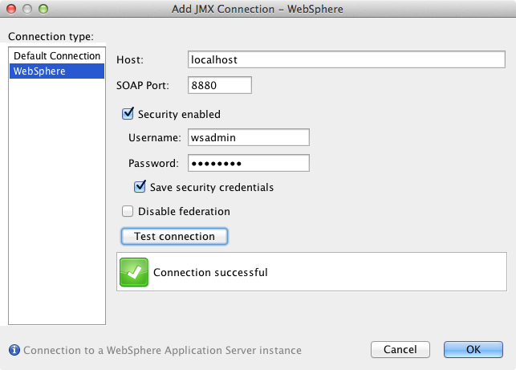
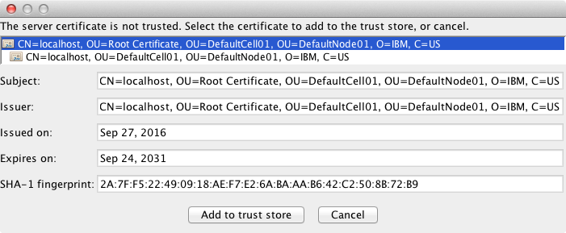
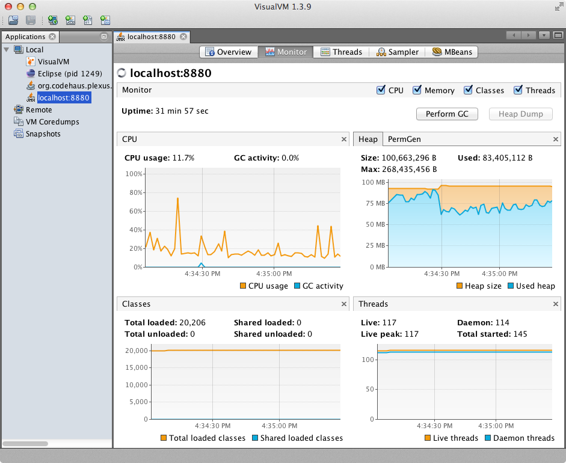
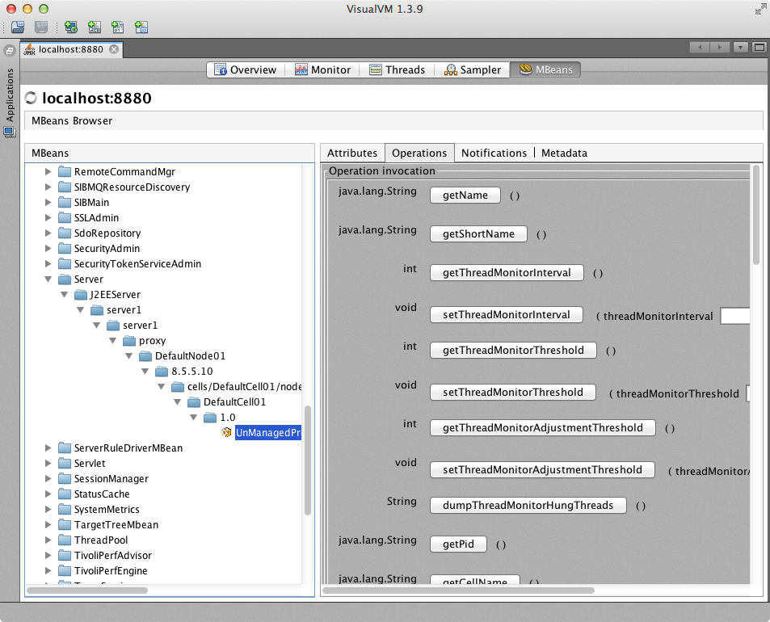

VisualWAS - WebSphere plugin for VisualVM
=========================================

## Introduction

The VisualWAS project provides a VisualVM plugin to connect to WebSphere Application Server. It is based on a GPL licensed implementation of WebSphere's proprietary JMX/SOAP protocol and therefore doesn't require any additional libraries from the WebSphere runtime.

Also provided is a WebSphere plugin that registers the [platform MXBeans][1] in WebSphere's MBean server so that memory and thread statistics are available in VisualVM.

## Compatibility

VisualWAS >= 4.0.0 is designed to work with VisualVM >= 2.0. Older versions of VisualWAS work with VisualVM 1.3.x and 1.4.x.

## Installation

### VisualVM plugin installation

1. Download the `VisualWAS-x.y.z.nbm` file for the latest VisualWAS release from the [Releases][2] page.

1. Choose _Tools > Plugins_ from the main menu in VisualVM.

1. In the _Plugins_ dialog that opens, switch to _Downloaded_ tab, then click _Add Plugins..._.

1. Select the downloaded .nbm file and click the _Open_ button.

1. Click the _Install_ button, review and accept the plugin license and wait for the plugin to be installed.

### WebSphere plugin installation

Perform the following steps if you want to access process statistics for your WebSphere server in VisualVM:

1. Download the `com.github.veithen.visualwas.mxbeans_x.y.z.jar` file for the latest VisualWAS release from the [Releases][2] page and copy it to the `plugins` directory of your WebSphere installation (typically `/opt/IBM/WebSphere/AppServer/plugins`).

1. If necessary, stop the WebSphere server. Then use the `osgiCfgInit` command to clear the OSGi cache, as described [here][3].

### Installation of the MBeans plugin

To access the MBeans registered in WebSphere's MBean server, you need to install the VisualVM-MBeans plugin:

1. Choose _Tools > Plugins_ from the main menu in VisualVM.

1. In the _Plugins_ dialog that opens, switch to _Available Plugins_ tab and click the checkbox next to `VisualVM-Beans`.

1. Click the _Install_ button, review and accept the plugin license and wait for the plugin to be installed.

## Usage

In order to connect to a WebSphere instance, select _Add JMX Connection_ as usual, but then select _WebSphere_ from the _Connection type_ list and enter the relevant information:

Use _Test connection_ to check that a connection to the WebSphere instance can successfully be established. If security is enabled, then you may be presented with a dialog to import the server certificate or one of the certificates in the certificate chain to the trust store:

You should typically add the root certificate to avoid problems later when the server certificate is renewed. For Network Deployment cells, this also allows you to connect to all servers in a cell without importing additional certificates.

After clicking _OK_ the new connection should appear in the _Applications_ view and you can start monitoring the server:

If you have installed VisualVM-MBeans plugin you can also interact with the MBeans exported by the server:

[1]: http://docs.oracle.com/javase/7/docs/technotes/guides/management/mxbeans.html
[2]: https://github.com/veithen/visualwas/releases
[3]: http://www-01.ibm.com/support/docview.wss?uid=swg21607887
